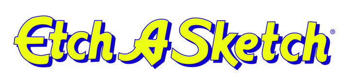

<!-- Improved compatibility of back to top link: See: https://github.com/othneildrew/Best-README-Template/pull/73 -->

<a id="readme-top"></a>

<!--
*** Thanks for checking out the Best-README-Template. If you have a suggestion
*** that would make this better, please fork the repo and create a pull request
*** or simply open an issue with the tag "enhancement".
*** Don't forget to give the project a star!
*** Thanks again! Now go create something AMAZING! :D
-->

<!-- PROJECT SHIELDS -->
<!--
*** I'm using markdown "reference style" links for readability.
*** Reference links are enclosed in brackets [ ] instead of parentheses ( ).
*** See the bottom of this document for the declaration of the reference variables
*** for contributors-url, forks-url, etc. This is an optional, concise syntax you may use.
*** https://www.markdownguide.org/basic-syntax/#reference-style-links
-->

[![Contributors][contributors-shield]][contributors-url]
[![Forks][forks-shield]][forks-url]
[![Stargazers][stars-shield]][stars-url]
[![Issues][issues-shield]][issues-url]
[![project_license][license-shield]][license-url]
[![LinkedIn][linkedin-shield]][linkedin-url]

<br />
<div align="center">
  <a href="https://github.com/ayemteezy/etch-a-sketch">
    
  </a>

<h3 align="center">Odin | Etch-a-Sketch</h3>

  <p align="center">
    An interactive, browser-based sketching board built using pure JavaScript, HTML, and CSS.
    <br />
    <a href="https://github.com/ayemteezy/etch-a-sketch"><strong>Explore the docs »</strong></a>
    <br />
    <br />
    <a href="https://ayemteezy.github.io/etch-a-sketch/">View Demo</a>
    &middot;
    <a href="https://github.com/ayemteezy/etch-a-sketch/issues/new?labels=bug&template=bug-report.md">Report Bug</a>
    &middot;
    <a href="https://github.com/ayemteezy/etch-a-sketch/issues/new?labels=enhancement&template=feature-request.md">Request Feature</a>
  </p>
</div>

<!-- TABLE OF CONTENTS -->
<details>
  <summary>Table of Contents</summary>
  <ol>
    <li>
      <a href="#about-the-project">About The Project</a>
      <ul>
        <li><a href="#built-with">Built With</a></li>
      </ul>
    </li>
    <li>
      <a href="#getting-started">Getting Started</a>
      <ul>
        <li><a href="#prerequisites">Prerequisites</a></li>
        <li><a href="#installation">Installation</a></li>
      </ul>
    </li>
    <li><a href="#usage">Usage</a></li>
    <li><a href="#roadmap">Roadmap</a></li>
    <li><a href="#contributing">Contributing</a></li>
    <li><a href="#license">License</a></li>
    <li><a href="#contact">Contact</a></li>
    <li><a href="#acknowledgments">Acknowledgments</a></li>
  </ol>
</details>

<!-- ABOUT THE PROJECT -->

## About The Project

[![Product Name Screen Shot][product-screenshot]](https://ayemteezy.github.io/etch-a-sketch/)

A browser-based sketchpad application built for The Odin Project. It uses JavaScript DOM manipulation to generate a customizable $N \times N$ grid with interactive hover effects.

<p align="right">(<a href="#readme-top">back to top</a>)</p>

### Built With

- [![HTML5][HTML5-badge]][HTML5-url]
- [![CSS3][CSS3-badge]][CSS3-url]
- [![JavaScript][JavaScript-badge]][JavaScript-url]

<p align="right">(<a href="#readme-top">back to top</a>)</p>

<!-- GETTING STARTED -->

## Getting Started

To get a local copy of this project up and running on your machine, follow these simple setup steps.

### Prerequisites

This project runs entirely in the browser and does not require a complex backend configuration. However, you will need:

- A modern web browser (e.g., Google Chrome, Mozilla Firefox, Brave, Safari).
- A code editor like **Visual Studio Code** (recommended) to inspect or modify the files.
- Optional: The **Live Server** extension for VS Code to view live updates instantly.

### Installation

1. **Clone the repository**

   ```sh
   git clone https://github.com
   ```

2. **Navigate into the project directory**
   ```sh
   cd etch-a-sketch
   ```
3. **Open the project**
   - Double-click the `index.html` file to launch it directly in your default browser.
   - Alternatively, open the folder in **VS Code** and use **Live Server** to preview the application locally.

<p align="right">(<a href="#readme-top">back to top</a>)</p>

<!-- USAGE EXAMPLES -->

## Usage

- **Draw:** Hover over the grid.
- **Resize:** Click "New" for a custom grid size.
- **Clear:** Reset the canvas.

<p align="right">(<a href="#readme-top">back to top</a>)</p>

<!-- ROADMAP -->

## Roadmap

- [x] Grid Generation
- [x] Hover Effects
- [x] Resize Functionality

See the [open issues](https://github.com/ayemteezy/etch-a-sketch/issues) for a full list of proposed features (and known issues).

<p align="right">(<a href="#readme-top">back to top</a>)</p>

<!-- CONTRIBUTING -->

## Contributing

Contributions are what make the open source community such an amazing place to learn, inspire, and create. Any contributions you make are **greatly appreciated**.

If you have a suggestion that would make this better, please fork the repo and create a pull request. You can also simply open an issue with the tag "enhancement".
Don't forget to give the project a star! Thanks again!

1. Fork the Project
2. Create your Feature Branch (`git checkout -b feature/AmazingFeature`)
3. Commit your Changes (`git commit -m 'Add some AmazingFeature'`)
4. Push to the Branch (`git push origin feature/AmazingFeature`)
5. Open a Pull Request

<p align="right">(<a href="#readme-top">back to top</a>)</p>

### Top contributors

<a href="https://github.com/ayemteezy/etch-a-sketch/graphs/contributors">
  
</a>

<!-- LICENSE -->

## License

Distributed under the project_license. See `LICENSE.txt` for more information.

<p align="right">(<a href="#readme-top">back to top</a>)</p>

<!-- CONTACT -->

## Contact

- Laurence Lester Cariño (Teezy) - [@ayemteezy\_](https://x.com/ayemteezy_) - <laurencelestercarino@gmail.com>
- Project Link: [https://github.com/ayemteezy/etch-a-sketch](https://github.com/ayemteezy/etch-a-sketch)

<p align="right">(<a href="#readme-top">back to top</a>)</p>

<!-- ACKNOWLEDGMENTS -->

## Acknowledgments

- [The Odin Project](https://theodinproject.com) - For the exceptional, comprehensive web development curriculum.
- [MDN Web Docs](https://mozilla.org) - For invaluable documentation on DOM manipulation and mouse events.
- [Shields.io](https://shields.io) - For providing the clean, dynamic data badges used in this repository.

<p align="right">(<a href="#readme-top">back to top</a>)</p>

<!-- MARKDOWN LINKS & IMAGES -->
<!-- https://www.markdownguide.org/basic-syntax/#reference-style-links -->

[contributors-shield]: https://img.shields.io/github/contributors/ayemteezy/etch-a-sketch.svg?style=for-the-badge
[contributors-url]: https://github.com/ayemteezy/etch-a-sketch/graphs/contributors
[forks-shield]: https://img.shields.io/github/forks/ayemteezy/etch-a-sketch.svg?style=for-the-badge
[forks-url]: https://github.com/ayemteezy/etch-a-sketch/network/members
[stars-shield]: https://img.shields.io/github/stars/ayemteezy/etch-a-sketch.svg?style=for-the-badge
[stars-url]: https://github.com/ayemteezy/etch-a-sketch/stargazers
[issues-shield]: https://img.shields.io/github/issues/ayemteezy/etch-a-sketch.svg?style=for-the-badge
[issues-url]: https://github.com/ayemteezy/etch-a-sketch/issues
[license-shield]: https://img.shields.io/github/license/ayemteezy/etch-a-sketch.svg?style=for-the-badge
[license-url]: https://github.com/ayemteezy/etch-a-sketch/blob/master/LICENSE.txt
[linkedin-shield]: https://img.shields.io/badge/-LinkedIn-black.svg?style=for-the-badge&logo=linkedin&colorB=555
[linkedin-url]: https://www.linkedin.com/in/laurence-lester-cari%C3%B1o/
[product-screenshot]: images/screenshot.jpg

<!-- Shields.io badges. You can a comprehensive list with many more badges at: https://github.com/inttter/md-badges -->

[HTML5-badge]: https://img.shields.io/badge/HTML5-E34F26?style=for-the-badge
[HTML5-url]: https://developer.mozilla.org/en-US/docs/Glossary/HTML5
[CSS3-badge]: https://img.shields.io/badge/CSS-663399?style=for-the-badge
[CSS3-url]: https://developer.mozilla.org/en-US/docs/Web/CSS
[JavaScript-badge]: https://img.shields.io/badge/JavaScript-F7DF1E?style=for-the-badge
[JavaScript-url]: https://developer.mozilla.org/en-US/docs/Web/JavaScript
